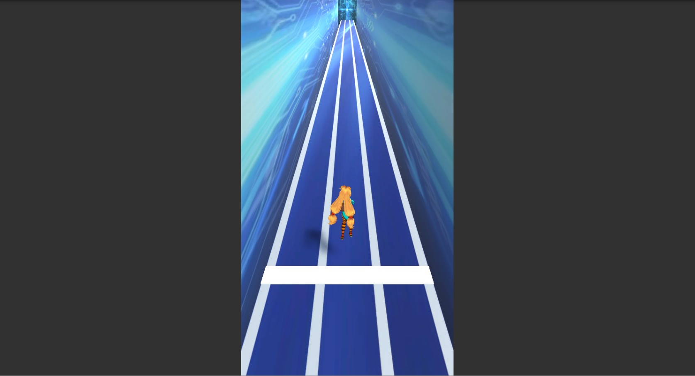

# ungeki

---
# ゲーム概要

・ターゲットプラットホーム：WebGL

・画面解像度：540×960

---
# 操作方法

・使用キー：左右矢印キー、A、S、D、Spaceキー

・左右矢印キー：移動

・A、S、Dキー：通常ノーツを拾う

・Spaceキー：特殊ノーツを拾う

---
# ルール

曲に合わせて得点玉やノーツが流れてくるので、
ノーツはタイミングを合わせて対応するキーを押し、
得点玉は矢印キーでキャラを移動させて集めてください。

また、得点玉のほかにダメージ玉も存在します。
ダメージ玉は拾ってしまうとダメージを受けてしまいます。
体力が無くなるとゲームオーバーです。
曲が終わった時に体力が残っていればクリアとなります

スコアはノーツを拾う、得点玉を集めることで増えます
うまく操作して高スコアを目指しましょう！
---
# 使用アセット

・unity-chan

・(今後増えます)
